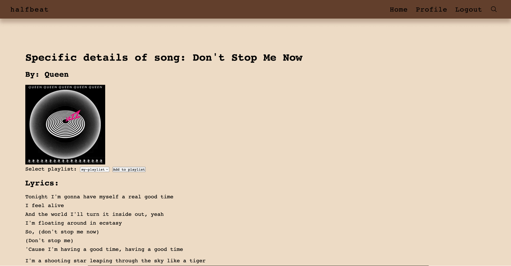
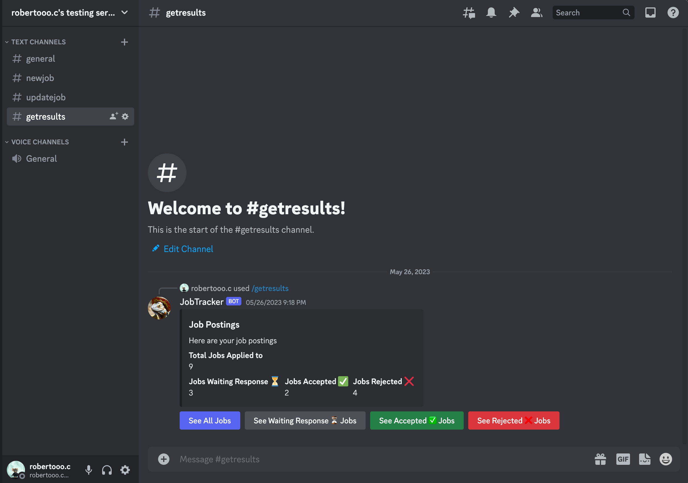
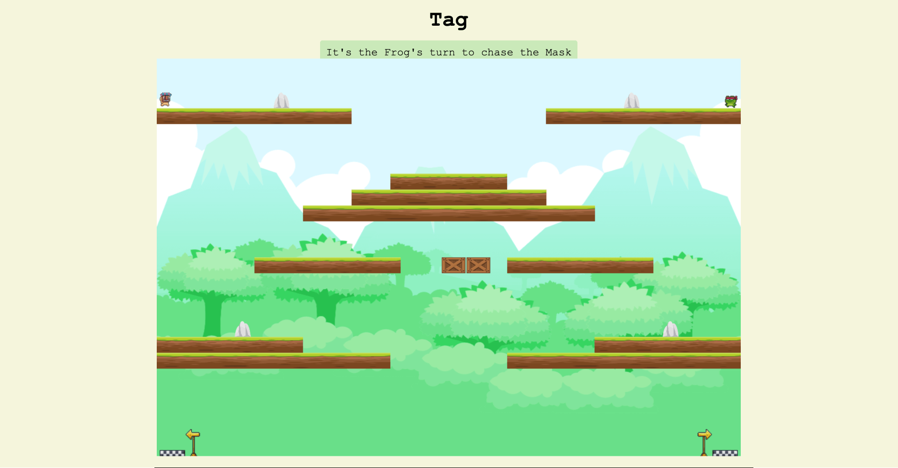

<table>
<tr>
<td>
As a highly motivated and coachable full stack developer, I am looking forward to continuing to develop my overall abilities wherever my career takes me. With the soft skills I have developed through my time working in the food industry coupled with my growing technical skills, I am able to effectively communicate with coworkers, stay focused in the face of increasing deadline pressure, and most importantly, increase production speed.
</td>
</tr>
</table>

## I've worked with:

### Skills/Tools:

| Skills     |            |
| ---------- | ---------- |
| HTML5      | CSS3       |
| React      | Tailwind   |
| JavaScript | TypeScript |
| NodeJs     | Express    |
| MongoDb    | PostgreSql |
| Git        | Heroku     |
| NextJs     | Vercel     |

# Projects

## [Typing Test Frontend](https://github.com/robertoooc/TypingTestApp-client)

### Mongoose/Express/React/Node/Typescript/Tailwind/Victory

I developed a Typing Test App that allows you to take random typing tests which will in return tells you which characters you had the most mistakes on. From here you are given the chance to further take more tests focusing on the area that needs most improvement. You also have the chance to view results of previous tests and compare progress.

### Check it out deployed here : [Typing Test App](https://benevolent-medovik-143b82.netlify.app/)

## [Music App](https://github.com/robertoooc/project-2)

### Postgres/Express/React/EJS/Musixmatch API/Last.fm API

A music app using a simple user authentication through storing user information in cookies. Incorporated two unrelated third party api's and enabled them to work together to gather song information and album images, works proficiently over 90% of time. Apart from letting users search songs and artists, this app allows a user to create playlists with the options of public or private playlists. Allows users to also view other's public playlists and perform actions such as liking and commenting on them.

### Check it out here : [Music App](https://roberto-project-two-1114.herokuapp.com/)

 

## [Discord Bot](https://github.com/robertoooc/Discord-bot)

### Nodejs/Discordjs/MongoDb/Heroku

A music app using a simple user authentication through storing user information in cookies. Incorporated two unrelated third party api's and enabled them to work together to gather song information and album images, works proficiently over 90% of time. Apart from letting users search songs and artists, this app allows a user to create playlists with the options of public or private playlists. Allows users to also view other's public playlists and perform actions such as liking and commenting on them.

### View Gif : [Discord Bot Gif](https://github.com/robertoooc/Discord-bot/blob/main/gifs/getResultsAll.gif)

### Check it out here : [Discord Bot Invite](https://discord.com/oauth2/authorize?client_id=1106759915466403870&permissions=26829587381312&scope=bot)

 

## [Tag](https://github.com/robertoooc/project1-pitch)

### Vanilla JavaScript Project

A basic 2d tag game built using vanilla JavaScript, HTML5, and CSS3.

### Check it out here : [Tag](https://robertoooc.github.io/project1-pitch/)

 

## Portfolio/Contact

Portfolio [roberto-contreras.com](https://www.roberto-contreras.com/) | Email [robertocontrerasdev@gmail.com](mailto:robertocontrerasdev@gmail.com)\
[LinkedIn](https://www.linkedin.com/in/robertocontreras-software/)
